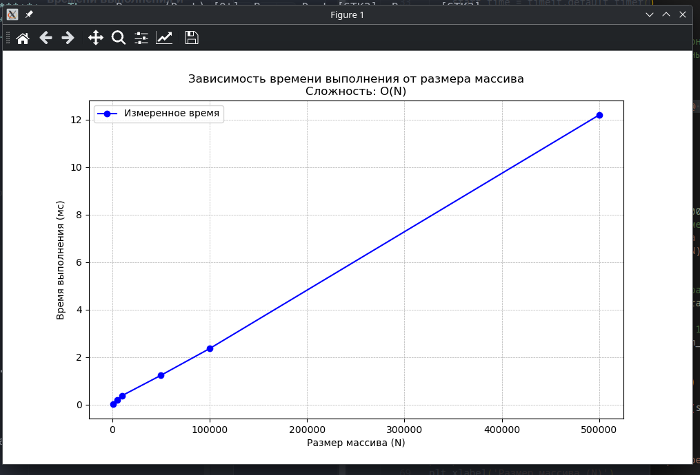

# Лабораторная работа №0
## Решение алгоритмических задач. Введение в инструменты и критерии оценки.

### Цель работы: Настроить рабочее окружение, освоить базовые операции ввода/вывода, написать и протестировать первую программу. Научиться оценивать сложность отдельных операций и всей программы, проводить эмпирические замеры времени выполнения и визуализировать результаты.

Характеристики ПК для тестирования:
- Процессор: Intel(R) Core(TM) i5-1155G7 (8) @ 4.50 GHz
- Оперативная память: 16 GB DDR4
- ОС: CachyOS x86_64
- Python: 3.17.4

Замеры времени выполнения для алгоритма суммирования массива:
| Размер (N) | Время (мс) | Время / N (мкс) |
| ---------- | ---------- | --------------- |
| 1 000      | 0.0233     | 0.0233          |
| 5 000      | 0.1666     | 0.0333          |
| 10 000     | 0.2239     | 0.0224          |
| 50 000     | 1.2604     | 0.0252          |
| 100 000    | 2.2592     | 0.0226          |
| 500 000    | 12.7825    | 0.0256          |

Анализ результатов:
1. Теоретическая сложность алгоритма: O(N)
2. Практические замеры показывают линейную зависимость времени от N
3. Время на один элемент примерно постоянно (~0.0253мкс)

