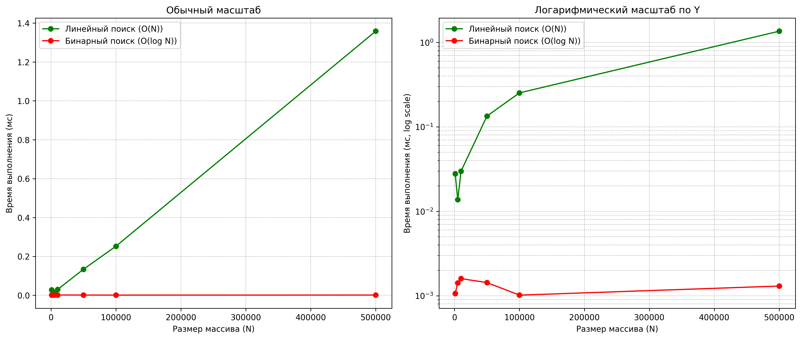

# Лабораторная работа №1
## Введение в алгоритмы. Сложность. Поиск.
### Цель работы: Освоить понятие вычислительной сложности алгоритма. Получить практические навыки реализации и анализа линейного и бинарного поиска. Научиться экспериментально подтверждать теоретические оценки сложности O(n) и O(log n).

### Теория (кратко):
- Сложность алгоритма: Характеризует количество ресурсов (времени и памяти), необходимых алгоритму для обработки входных данных объема n.
- Асимптотический анализ: Анализ поведения алгоритма при стремлении n к бесконечности. Позволяет абстрагироваться от констант и аппаратных особенностей.
- O-нотация («О-большое»): Верхняя асимптотическая оценка роста функции. Определяет наихудший сценарий работы алгоритма.
- Линейный поиск (Linear Search): Последовательный перебор всех элементов массива. Сложность: O(n).
- Бинарный поиск (Binary Search): Поиск в отсортированном массиве путем многократного деления интервала поиска пополам. Сложность: O(log n). Требует предварительной сортировки (O(n log n)).

### Теоретические ожидания

Линейный поиск (O(n))
Каждый элемент массива проверяется последовательно.
При размере массива N время работы растёт прямо пропорционально N, потому что чем больше у нас элементов, тем потенциально более долго будет осуществляться поиск.

В среднем придётся просмотреть N/2 элементов. Это если элемент в центре.

В худшем случае — все N. Это если элемент в самом конце массива.

Бинарный поиск (O(log n))
Массив делится пополам на каждом шаге.
Количество операций — примерно log₂(N).
Время поиска растёт очень медленно. Но это работает только с отсортированными списками.

### Практические результаты

Замеры показали, что:

Линейный поиск действительно растёт почти линейно с увеличением размера массива.

Бинарный поиск остаётся практически постоянным (слабый рост виден только на логарифмическом графике).

#### Для target = 100

Замеры времени выполнения для алгоритма суммирования массива:
| Алгоритм | Размер (N) | Время (мс) | Время / N (мкс) |
| -------- | ---------- | ---------- | --------------- |
| Linear   | 1 000      | 0.0279     | 0.0279          |
| Binary   | 1 000      | 0.0011     | 0.0011          |
| Linear   | 5 000      | 0.0137     | 0.0027          |
| Binary   | 5 000      | 0.0014     | 0.0003          |
| Linear   | 10 000     | 0.0298     | 0.0030          |
| Binary   | 10 000     | 0.0016     | 0.0002          |
| Linear   | 50 000     | 0.1341     | 0.0027          |
| Binary   | 50 000     | 0.0014     | 0.0000          |
| Linear   | 100 000    | 0.2526     | 0.0025          |
| Binary   | 100 000    | 0.0010     | 0.0000          |
| Linear   | 500 000    | 1.3582     | 0.0027          |
| Binary   | 500 000    | 0.0013     | 0.0000          |

#### Для targte = 1000

Замеры времени выполнения для алгоритма суммирования массива:
| Алгоритм | Размер (N) | Время (мс) | Время / N (мкс) |
| -------- | ---------- | ---------- | --------------- |
| Linear   | 1 000      | 0.0235     | 0.0235          |
| Binary   | 1 000      | 0.0018     | 0.0018          |
| Linear   | 5 000      | 0.1332     | 0.0266          |
| Binary   | 5 000      | 0.0010     | 0.0002          |
| Linear   | 10 000     | 0.3258     | 0.0326          |
| Binary   | 10 000     | 0.0041     | 0.0004          |
| Linear   | 50 000     | 1.3713     | 0.0274          |
| Binary   | 50 000     | 0.0021     | 0.0000          |
| Linear   | 100 000    | 2.9698     | 0.0297          |
| Binary   | 100 000    | 0.0026     | 0.0000          |
| Linear   | 500 000    | 39.5512    | 0.0791          |
| Binary   | 500 000    | 0.0032     | 0.0000          |

Вывод:
В ходе решения лабораторной работы были произведены множественные эксперименты
с замером времени выполнения поиска целевого элемента массива.
Графики показывают, что время выполнения и зависимость алгоритмов соответствует теоретическим.
