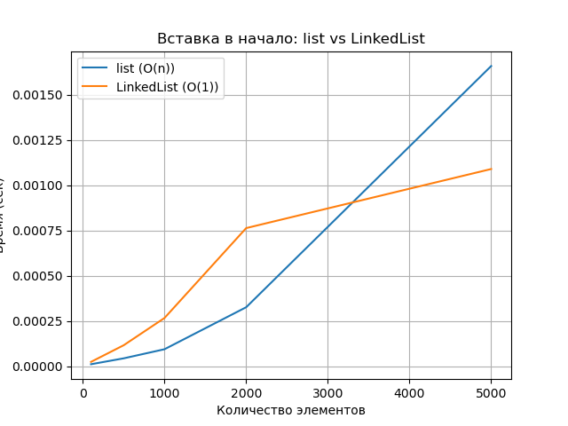
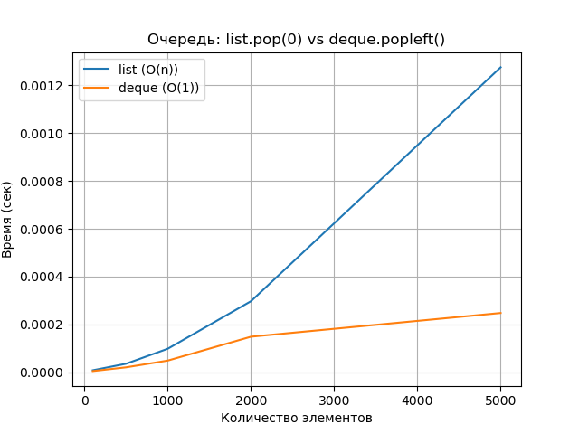

# Лабораторная работа №2  
## Основные структуры данных. Анализ и применение

---

## Цель работы

Изучить понятие и особенности базовых абстрактных типов данных (стек, очередь, дек,
связный список) и их реализаций в Python. Научиться выбирать оптимальную структуру данных для
решения конкретной задачи, основываясь на анализе теоретической и практической сложности
операций. Получить навыки измерения производительности и применения структур данных для
решения практических задач

---

## Задания работы

1. Реализовать класс LinkedList (связный список) для демонстрации принципов его работы.
2. Используя встроенные типы данных (list, collections.deque), проанализировать
эффективность операций, имитирующих поведение стека, очереди и дека.
3. Провести сравнительный анализ производительности операций для разных структур данных
(list vs LinkedList для вставки, list vs deque для очереди).
4. Решить 2-3 практические задачи, выбрав оптимальную структуру данных

---

## Характеристики вычислительной машины

- **Процессор:** Intel x86_64  
- **Оперативная память:** 16 GB  
- **Операционная система:** Linux с ядром CachyOS
- **Версия Python:** Python 3.13

---

## Реализация связного списка

Были реализованы классы Node и LinkedList.  
Связный список поддерживает следующие операции:

| Операция | Описание | Асимптотическая сложность |
|--------|----------|---------------------------|
| insert_at_start | Вставка элемента в начало | O(1) |
| insert_at_end | Вставка элемента в конец (с tail-указателем) | O(1) |
| delete_from_start | Удаление элемента из начала | O(1) |
| traversal | Обход списка | O(n) |

---

## Анализ производительности

### 1. Вставка в начало структуры данных

Сравнивались:
- list.insert(0, value) — сложность O(n)
- LinkedList.insert_at_start(value) — сложность O(1)

#### График

**Описание:**  
График демонстрирует линейный рост времени выполнения для list и практически
постоянное время для связного списка, что подтверждает теоретическую асимптотику.

---

### 2. Очередь: удаление из начала

Сравнивались:
- list.pop(0) — сложность O(n)
- deque.popleft() — сложность O(1)

#### График

**Описание:**  
Для списка удаление первого элемента требует сдвига всех последующих элементов,
что приводит к линейному росту времени.  
Для дека операция выполняется за постоянное время.

---

## Практические задачи

### 1. Проверка сбалансированности скобок

Используемая структура: **стек (list)**  
Обоснование: требуется доступ только к последнему добавленному элементу (LIFO).

Сложность алгоритма: **O(n)**

---

### 2. Симуляция очереди печати

Используемая структура: **deque**  
Обоснование: эффективное добавление и удаление элементов с обоих концов.

Сложность алгоритма: **O(n)**

---

### 3. Проверка палиндрома

Используемая структура: **deque**  
Обоснование: необходимо сравнивать элементы с начала и конца последовательности
за постоянное время.

Сложность алгоритма: **O(n)**

---

## Контрольные вопросы

### 1. В чем ключевое отличие динамического массива (list) от связного списка?

list хранит элементы в непрерывной области памяти, поэтому:
- доступ по индексу выполняется за O(1),
- вставка в начало требует сдвига элементов — O(n).

Связный список хранит элементы в узлах, связанных указателями:
- вставка в начало выполняется за O(1),
- доступ по индексу требует последовательного обхода — O(n).

---

### 2. Принцип работы стека и очереди

**Стек (LIFO — Last In, First Out):**
- последний добавленный элемент извлекается первым.

Примеры использования:
- система отмены действий (undo),
- вызовы функций (call stack).

**Очередь (FIFO — First In, First Out):**
- первый добавленный элемент извлекается первым.

Примеры использования:
- обработка задач в принтере,
- очереди запросов в серверных приложениях.

---

### 3. Почему list.pop(0) — O(n), а deque.popleft() — O(1)?

В list все элементы хранятся подряд, и при удалении первого элемента
необходимо сдвинуть остальные элементы влево.

В deque используется двусторонняя очередь, где элементы не требуют
перемещения при удалении с начала.

---

### 4. Структура данных для реализации undo в текстовом редакторе

Оптимальный выбор — **стек**.

Обоснование:
- операции отменяются в обратном порядке их выполнения,
- стек обеспечивает быстрые операции добавления и извлечения (O(1)).

---

### 5. Почему вставка 1000 элементов в начало списка медленнее, чем в связный список?

Вставка в начало list имеет сложность O(n), так как каждый раз требуется
сдвиг всех существующих элементов.

В связном списке вставка в начало выполняется за O(1), так как меняется
только ссылка на голову списка.

При большом количестве операций эта разница приводит к кардинальному
разрыву во времени выполнения, что и подтверждают экспериментальные замеры.

---
