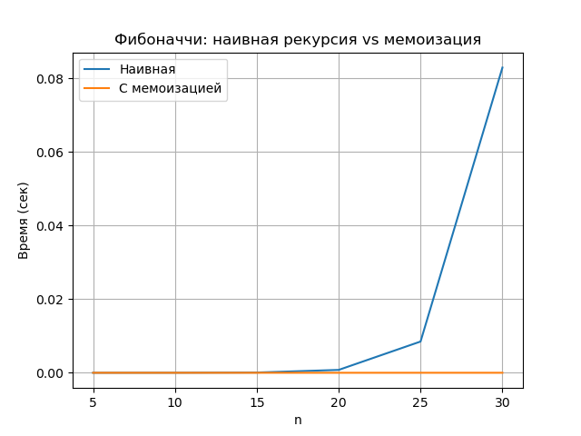

# Лабораторная работа №3  
## Рекурсия

---

## Цель работы

Освоить принцип рекурсии, научиться анализировать рекурсивные алгоритмы и
понимать механизм работы стека вызовов. Изучить типичные задачи, решаемые рекурсивно, и освоить
технику мемоизации для оптимизации рекурсивных алгоритмов. Получить практические навыки
реализации и отладки рекурсивных функций

---

## Задания работы

1. Реализовать классические рекурсивные алгоритмы.
2. Проанализировать их временную сложность и глубину рекурсии.
3. Реализовать оптимизацию рекурсивных алгоритмов с помощью мемоизации.
4. Сравнить производительность наивной рекурсии и рекурсии с мемоизацией.
5. Решить практические задачи с применением рекурсии.

---

## Характеристики вычислительной машины

- **Процессор:** Intel x86_64  
- **Оперативная память:** 16 GB  
- **Операционная система:** Linux с ядром CachyOS
- **Версия Python:** Python 3.13

---

## Реализация рекурсивных алгоритмов

| Алгоритм | Временная сложность | Глубина рекурсии |
|--------|---------------------|------------------|
| Факториал | O(n)                | O(n) |
| Фибоначчи (наивный) | O(2^n)              | O(n) |
| Быстрое возведение в степень | O(log n)            | O(log n) |

---

## Мемоизация чисел Фибоначчи

Для оптимизации вычисления чисел Фибоначчи была реализована мемоизация,
основанная на сохранении ранее вычисленных значений в словаре.

### Сравнение для n = 35

- Наивная рекурсия:
  - Экспоненциальное количество рекурсивных вызовов
  - Существенное время выполнения
- Рекурсия с мемоизацией:
  - Линейное количество вызовов
  - Значительно меньшее время выполнения

Мемоизация меняет сложность алгоритма с **O(2^n)** на **O(n)**.

### График сравнения



---

## Практические задачи

### 1. Бинарный поиск

Использована рекурсия для поиска элемента в отсортированном массиве.

- Временная сложность: O(log n)
- Глубина рекурсии: O(log n)

---

### 2. Ханойские башни

Рекурсивный алгоритм перемещения n дисков между тремя стержнями.

- Временная сложность: O(2^n)
- Глубина рекурсии: O(n)

Для каждого шага на экран выводится перемещение диска между стержнями.

```
Ханойские башни (n=3):
A -> C
A -> B
C -> B
A -> C
B -> A
B -> C
A -> C
```

---

### 3. Рекурсивный обход файловой системы

Реализован рекурсивный вывод дерева каталогов и файлов, начиная с заданного пути.

- Временная сложность: O(n), где n — количество файлов и каталогов
- Глубина рекурсии зависит от глубины вложенности директорий

---

## Анализ результатов

Экспоненциальный рост времени наивного алгоритма Фибоначчи объясняется
повторным вычислением одних и тех же значений.

Мемоизация устраняет эти повторения, сохраняя результаты вычислений,
что радикально снижает количество рекурсивных вызовов и изменяет
асимптотическую сложность алгоритма.

Глубина рекурсии напрямую связана со стеком вызовов, который ограничен.
При слишком глубокой рекурсии возможна ошибка переполнения стека.

---

## Контрольные вопросы

### 1. Базовый случай и рекурсивный шаг

Базовый случай — это условие завершения рекурсии.  
Рекурсивный шаг — вызов функции самой себя с упрощёнными аргументами.

Отсутствие базового случая приводит к бесконечным вызовам и переполнению стека.

---

### 2. Принцип работы мемоизации

Мемоизация сохраняет результаты вычислений и повторно использует их.
Для чисел Фибоначчи она уменьшает сложность с O(2^n) до O(n).

---

### 3. Проблема глубокой рекурсии

Глубокая рекурсия приводит к большому количеству кадров в стеке вызовов.
При превышении лимита возникает ошибка `RecursionError`.

---

### 4. Ханойские башни для 3 дисков

1. Переместить 2 диска с первого стержня на вспомогательный.
2. Переместить самый большой диск на целевой стержень.
3. Переместить 2 диска со вспомогательного стержня на целевой.

---

### 5. Рекурсивные и итеративные алгоритмы

**Рекурсивные:**
- проще для понимания и реализации,
- могут приводить к переполнению стека.

**Итеративные:**
- эффективнее по памяти,
- иногда сложнее для реализации.

---
