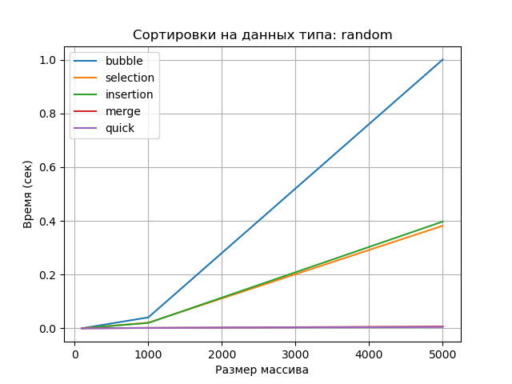
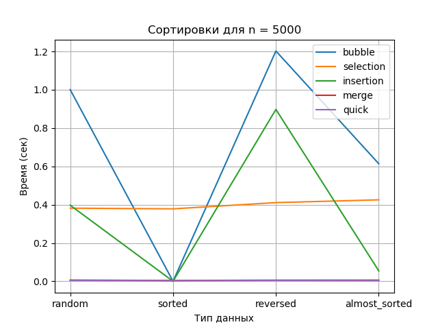

# Лабораторная работа №4  
## Алгоритмы сортировки

---

## Цель работы

Изучить и реализовать основные алгоритмы сортировки. Провести их теоретический и
практический сравнительный анализ по временной и пространственной сложности. Исследовать
влияние начальной упорядоченности данных на эффективность алгоритмов. Получить навыки
эмпирического анализа производительности алгоритмов.

---

## Задания работы

1. Реализовать 5 алгоритмов сортировки.
2. Провести теоретический анализ сложности каждого алгоритма.
3. Экспериментально сравнить время выполнения алгоритмов на различных наборах данных.
4. Проанализировать влияние начальной упорядоченности данных на эффективность сортировок.

---

## Характеристики вычислительной машины

- **Процессор:** Intel x86_64  
- **Оперативная память:** 16 GB  
- **Операционная система:** Linux с ядром CachyOS
- **Версия Python:** Python 3.13

---

## Реализованные алгоритмы сортировки

| Алгоритм | Лучший случай | Средний случай | Худший случай | Память |
|--------|---------------|----------------|---------------|--------|
| Bubble Sort | O(n) | O(n²) | O(n²) | O(1) |
| Selection Sort | O(n²) | O(n²) | O(n²) | O(1) |
| Insertion Sort | O(n) | O(n²) | O(n²) | O(1) |
| Merge Sort | O(n log n) | O(n log n) | O(n log n) | O(n) |
| Quick Sort | O(n log n) | O(n log n) | O(n²) | O(log n) |

---

## Подготовка тестовых данных

Были сгенерированы массивы целых чисел следующих типов:

- случайные данные (random);
- уже отсортированные (sorted);
- отсортированные в обратном порядке (reversed);
- почти отсортированные (almost sorted, ~95% элементов упорядочены).

Размеры массивов: **100, 1000, 5000 элементов**.

---

## Исследование

Замеры времени выполнения производились с использованием модуля `timeit`.
Перед каждой сортировкой создавалась копия исходного массива.
Корректность сортировки проверялась автоматически.

---

### Зависимость времени от размера массива (случайные данные)

**Описание:**  
На графике видно, что алгоритмы с квадратичной сложностью быстро теряют
производительность при росте размера массива.  
Merge Sort и Quick Sort показывают лучшие результаты.

---

### Влияние типа данных (n = 5000)

**Описание:**  
Insertion Sort демонстрирует высокую эффективность на почти отсортированных данных,
в то время как Bubble Sort и Selection Sort остаются медленными независимо от типа данных.

---

## Контрольные вопросы

### 1. Алгоритмы с O(n²) и O(n log n)

Сложность O(n²) имеют:
- Bubble Sort
- Selection Sort
- Insertion Sort (в худшем случае)

Сложность O(n log n) имеют:
- Merge Sort
- Quick Sort (в среднем случае)

---

### 2. Почему Insertion Sort эффективен для почти отсортированных массивов?

Потому что количество сдвигов элементов минимально, и алгоритм работает
практически за линейное время.

---

### 3. Устойчивая и неустойчивая сортировка

**Устойчивая сортировка** сохраняет относительный порядок равных элементов
(например, Insertion Sort, Merge Sort).

**Неустойчивая сортировка** может его нарушать
(например, Selection Sort, Quick Sort).

---

### 4. Принцип работы Quick Sort

Алгоритм выбирает опорный элемент (pivot) и разделяет массив на элементы
меньше и больше опорного.  
Неудачный выбор pivot (например, первый элемент в отсортированном массиве)
приводит к худшему случаю O(n²).

---

### 5. Когда Merge Sort предпочтительнее Quick Sort?

- когда важна стабильность сортировки;
- когда требуется гарантированное время O(n log n);
- при работе с большими объемами данных или внешней памятью.

---
