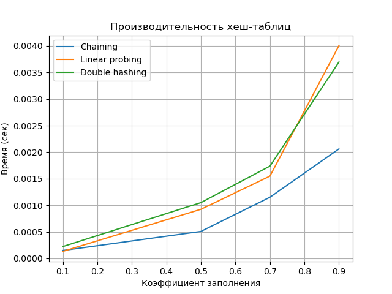
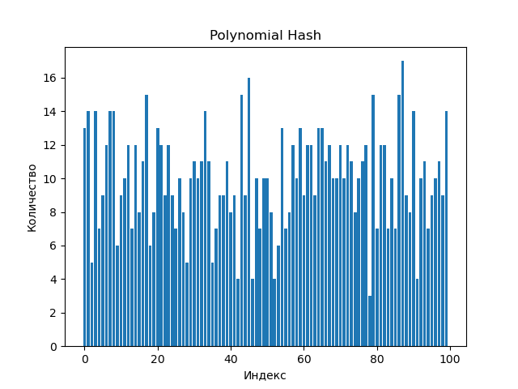
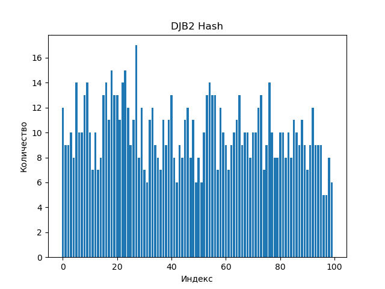

# Хеш-функции и хеш-таблицы

## Цель работы

Изучить принципы работы хеш-функций и хеш-таблиц. Освоить методы разрешения
коллизий. Получить практические навыки реализации хеш-таблицы с различными стратегиями
разрешения коллизий. Провести сравнительный анализ эффективности разных методов.

---

## Задание

1. Реализовать несколько хеш-функций для строковых ключей.
2. Реализовать хеш-таблицу с методом цепочек.
3. Реализовать хеш-таблицу с открытой адресацией (линейное пробирование и двойное
хеширование).
4. Провести сравнительный анализ эффективности разных методов разрешения коллизий.
5. Исследовать влияние коэффициента заполнения на производительность.

---

## Характеристики вычислительной машины

- **Процессор:** Intel x86_64  
- **Оперативная память:** 16 GB  
- **Операционная система:** Linux с ядром CachyOS
- **Версия Python:** Python 3.13

---

## Реализованные хеш-функции

### 1. Простая хеш-функция (сумма кодов символов)

* Использует суммирование ASCII-кодов символов строки

### 2. Полиномиальная хеш-функция

* Использует полиномиальное накопление с фиксированным основанием

### 3. Хеш-функция DJB2

* Использует битовые сдвиги и сложение

---

## Реализация хеш-таблиц

### Метод цепочек

* Каждая ячейка таблицы содержит список элементов
* При коллизии элементы добавляются в цепочку

**Сложность операций:**

* Средний случай: O(1)
* Худший случай: O(n)

Поддерживается динамическое масштабирование при превышении порога коэффициента заполнения.

### Открытая адресация — линейное пробирование

* Коллизии разрешаются поиском следующей свободной ячейки

**Сложность операций:**

* Средний случай: O(1)
* Худший случай: O(n)

Недостаток: эффект кластеризации при высоком коэффициенте заполнения.

### Открытая адресация — двойное хеширование

* Используются две хеш-функции
* Вторичная функция определяет шаг пробирования

**Сложность операций:**

* Средний случай: O(1)
* Худший случай: O(n)

Преимущество: меньше кластеризация по сравнению с линейным пробированием.

---

## Исследование

### Параметры

* Коэффициенты заполнения: 0.1, 0.5, 0.7, 0.9
* Операция: вставка элементов
* Ключи: случайно сгенерированные строки

Для каждого прогона использовалась новая копия данных.

---

## Визуализация результатов

### График зависимости времени вставки от коэффициента заполнения

На графике показано увеличение времени выполнения операций при росте коэффициента заполнения. Заметно ухудшение производительности у методов открытой адресации.

---

### Гистограммы распределения коллизий

Гистограммы демонстрируют качество распределения различных хеш-функций. DJB2 и полиномиальный хеш обеспечивают более равномерное распределение по сравнению с простой суммой кодов.

---

## Анализ результатов

* Метод цепочек показывает стабильную производительность даже при высоком коэффициенте заполнения
* Линейное пробирование сильно деградирует при коэффициенте заполнения выше 0.7
* Двойное хеширование работает устойчивее линейного пробирования
* Качество хеш-функции напрямую влияет на количество коллизий и скорость операций

**Оптимальный коэффициент заполнения:**

* Метод цепочек: до 0.9
* Линейное пробирование: до 0.6–0.7
* Двойное хеширование: до 0.7–0.8

---

## Контрольные вопросы

### 1. Каким требованиям должна удовлетворять хорошая хеш-функция?

Хорошая хеш-функция должна быть быстрой, детерминированной и обеспечивать равномерное распределение ключей по таблице, минимизируя коллизии.

### 2. Что такое коллизия в хеш-таблице?

Коллизия возникает, когда разные ключи отображаются в один и тот же индекс таблицы. Основные методы разрешения — метод цепочек и открытая адресация.

### 3. Разница между методом цепочек и открытой адресацией

Метод цепочек использует дополнительную память для списков, но устойчив при высоком заполнении. Открытая адресация экономит память, но быстрее деградирует по времени.

### 4. Почему операции выполняются за O(1) в среднем?

При равномерном распределении ключей и умеренном коэффициенте заполнения число проверяемых элементов остается постоянным.

### 5. Что такое коэффициент заполнения?

Коэффициент заполнения — это отношение числа элементов к размеру таблицы. При превышении порогового значения обычно выполняется рехеширование с увеличением размера таблицы.

---
