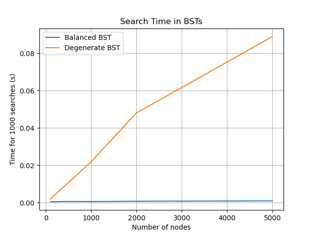

# Деревья. Бинарные деревья поиска

## Цель
Изучить древовидные структуры данных, их свойства и применение. Освоить основные
операции с бинарными деревьями поиска (BST). Получить практические навыки реализации BST на
основе узлов (pointer-based), рекурсивных алгоритмов обхода и анализа их эффективности.
Исследовать влияние сбалансированности дерева на производительность операций.

---

## 1. Задача
1. Реализовать бинарное дерево поиска на основе узлов с основными операциями.
2. Реализовать различные методы обхода дерева (рекурсивные и итеративные).
3. Реализовать дополнительные методы для работы с BST.
4. Провести анализ сложности операций для сбалансированного и вырожденного деревьев.
5. Визуализировать структуру дерева

---

## Характеристики ПК
- **Процессор:** Intel x86_64  
- **Оперативная память:** 16 GB  
- **Операционная система:** Linux с ядром CachyOS
- **Версия Python:** Python 3.13

---

## 2. Реализация BST

### Основные классы

- `TreeNode` – узел дерева с полями `value`, `left`, `right`.  
- `BinarySearchTree` – бинарное дерево поиска с методами:
  - `insert(value)` – вставка значения.  
    **Сложность:** O(log n) / O(n)
  - `search(value)` – поиск значения.  
    **Сложность:** O(log n) / O(n)
  - `delete(value)` – удаление узла.  
    **Сложность:** O(log n) / O(n)
  - `find_min(node)`, `find_max(node)` – поиск минимального и максимального элементов.  
    **Сложность:** O(log n) / O(n)
  - `is_valid_bst()` – проверка корректности BST.  
    **Сложность:** O(n)
  - `height(node)` – вычисление высоты дерева.  
    **Сложность:** O(n)
  - `visualize()` – текстовая визуализация дерева.

---

## 3. Методы обхода дерева

### Рекурсивные
- In-order: левое поддерево → узел → правое поддерево
- Pre-order: узел → левое поддерево → правое поддерево
- Post-order: левое поддерево → правое поддерево → узел

### Итеративный
- In-order обход с использованием стека

---

## 4. Исследование

### Настройка
- Сравнивались два типа деревьев:
  1. **Сбалансированное:** элементы вставляются в случайном порядке  
  2. **Вырожденное:** элементы вставляются в отсортированном порядке

- Для каждого дерева выполнялись 1000 операций поиска.

### Результаты



- Синяя линия – сбалансированное дерево (логарифмическая зависимость)  
- Оранжевая линия – вырожденное дерево (линейная зависимость)

---

## 5. Визуализация дерева

```
Tree visualization:
      80
     / 
   70
  /   \
 /     60
50
 \     40
  \   / 
   30
     \
      20
```

---
## 7. Контрольные вопросы

1. **Основное свойство BST:** для каждого узла все значения в левом поддереве меньше, а в правом – больше.  
2. **Алгоритм вставки:** идём от корня, сравниваем значение с текущим узлом, вставляем в левое или правое поддерево.  
   2.1. Сложность: O(log n) в сбалансированном дереве, O(n) в вырожденном.  
3. **DFS vs BFS:** DFS – обход в глубину (pre-, in-, post-order), BFS – обход в ширину по уровням.  
4. **Почему O(n) для вырожденного BST:** высота дерева ≈ n, поэтому поиск и вставка линейны.  
5. **Сбалансированное дерево:** дерево с ограниченной высотой (например, AVL), поддерживает O(log n) для основных операций и предотвращает вырождение.