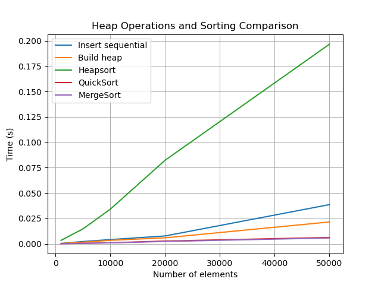

# Кучи (Heaps)

## Цель работы

Изучить структуру данных "куча" (heap), её свойства и применение. Освоить основные
операции с кучей (добавление, извлечение корня) и алгоритм её построения. Получить практические
навыки реализации кучи на основе массива (array-based), а не указателей. Исследовать эффективность
основных операций и применение кучи для сортировки и реализации приоритетной очереди

---

## Задание

1. Реализовать структуру данных "куча" (min-heap и max-heap) на основе массива.
2. Реализовать основные операции и алгоритм построения кучи из массива.
3. Реализовать алгоритм сортировки кучей (Heapsort).
4. Провести анализ сложности операций.
5. Сравнить производительность сортировки кучей с другими алгоритмами.

---

## Характеристики вычислительной машины

- **Процессор:** Intel x86_64  
- **Оперативная память:** 16 GB  
- **Операционная система:** Linux с ядром CachyOS
- **Версия Python:** Python 3.13

---

## 2. Реализация кучи

### Основные методы класса `Heap`:
- `_sift_up(index)` – всплытие элемента, O(log n)  
- `_sift_down(index)` – погружение элемента, O(log n)  
- `insert(value)` – вставка элемента, O(log n)  
- `extract()` – извлечение корня, O(log n)  
- `peek()` – просмотр корня, O(1)  
- `build_heap(array)` – построение кучи из массива, O(n)  
- `visualize()` – текстовая визуализация дерева  

**Свойство кучи:**  
- Min-heap: значение каждого узла ≤ значений детей.  
- Max-heap: значение каждого узла ≥ значений детей.  

---

## 3. Сортировка Heapsort

### Алгоритм:
1. Построение кучи из массива (max-heap для сортировки по возрастанию).  
2. Последовательное извлечение корня для формирования отсортированного массива.  
3. In-place версия переставляет элементы массива без дополнительной памяти.

**Сложность:** O(n log n) в среднем и худшем случае.

---

## 4. Приоритетная очередь

Реализована через max-heap:
- `enqueue(item, priority)` – добавление элемента с приоритетом, O(log n)  
- `dequeue()` – извлечение элемента с наивысшим приоритетом, O(log n)  
- `peek()` – просмотр элемента с наивысшим приоритетом, O(1)

---

## 5. Исследование

### Настройка
- Сравнивались методы построения кучи:
  1. Последовательная вставка (`insert`)  
  2. Алгоритм `build_heap`
- Сравнивалась производительность сортировки:
  - Heapsort
  - QuickSort (`list.sort()`)
  - MergeSort (`sorted()`)

### Результаты

Вывод:  
- `build_heap` быстрее последовательной вставки, особенно на больших массивах.  
- Heapsort работает за O(n log n) и менее эффективен, чем QuickSort на случайных данных, но стабильен.  
- In-place Heapsort экономит память.  

---

# Контрольные вопросы

### 1. Сформулируйте основное свойство min-кучи и max-кучи.

Min-куча: значение каждого узла меньше или равно значениям всех его детей.  
Max-куча: значение каждого узла больше или равно значениям всех его детей.  
Корень содержит минимальный (min-heap) или максимальный (max-heap) элемент.

---

### 2. Опишите алгоритм операции вставки нового элемента в кучу (sift_up).

Элемент добавляется в конец массива, затем всплывает вверх: сравнивается с родителем и меняется с ним местами, пока не восстановится свойство кучи.  
Сложность операции: O(log n).

---

### 3. Какова временная сложность построения кучи из произвольного массива и почему она равна O(n), а не O(n log n)?

Алгоритм `build_heap` выполняет _sift_down_ для всех узлов, начиная с половины массива.  
Глубина поддеревьев уменьшается снизу вверх, поэтому суммарная сложность всех операций составляет O(n), а не O(n log n), как при последовательной вставке.

---

### 4. Опишите, как работает алгоритм пирамидальной сортировки (Heapsort).

1. Построить max-кучу из исходного массива.  
2. Последовательно извлекать корень (максимальный элемент) и помещать его в конец массива.  
3. После каждого извлечения восстанавливать свойство кучи.  
В итоге массив становится отсортированным по возрастанию. Сложность: O(n log n).

---

### 5. Почему кучу часто используют для реализации приоритетной очереди? Какие операции приоритетной очереди она эффективно поддерживает?

Куча позволяет быстро поддерживать порядок по приоритету.  
Эффективные операции:  
- `enqueue(item, priority)` — вставка элемента с приоритетом, O(log n)  
- `dequeue()` — извлечение элемента с наивысшим приоритетом, O(log n)  
- `peek()` — просмотр элемента с наивысшим приоритетом, O(1)