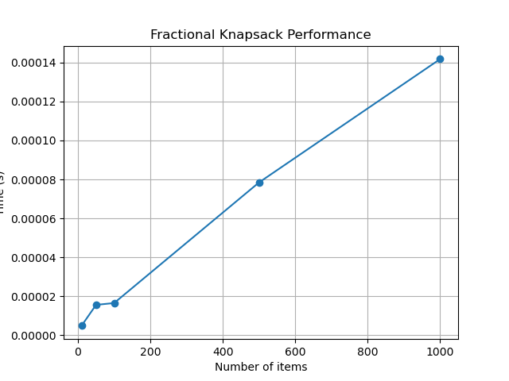

# Жадные алгоритмы

## Цель
Изучить метод проектирования алгоритмов, известный как "жадный алгоритм". Освоить
принцип принятия локально оптимальных решений на каждом шаге и понять условия, при которых этот
подход приводит к глобально оптимальному решению. Получить практические навыки реализации
жадных алгоритмов для решения классических задач, анализа их корректности и оценки
эффективности.

---

## Задача
1. Реализовать классические жадные алгоритмы.
2. Проанализировать их корректность (доказать или объяснить, почему жадный выбор приводит к
оптимальному решению).
3. Провести сравнительный анализ эффективности жадного подхода и других методов (например,
полного перебора для маленьких входных данных).
4. Решить практические задачи с применением жадного подхода.

---

## Характеристики ПК
- **Процессор:** Intel x86_64  
- **Оперативная память:** 16 GB  
- **Операционная система:** Linux с ядром CachyOS
- **Версия Python:** Python 3.13

---

## 2. Реализация жадных алгоритмов

### 2.1 Interval Scheduling
- Сортировка интервалов по времени окончания  
- Выбор следующего интервала, который не пересекается с предыдущим  
- Сложность: **O(n log n)**  
- Корректность: выбор интервала с наименьшим временем окончания оставляет максимум времени для последующих интервалов  

**Пример работы:**
```
Intervals: [(1,3),(2,5),(4,7),(6,9)]
Selected: [(1,3),(4,7)]
```


---

### 2.2 Fractional Knapsack
- Сортировка предметов по удельной стоимости (value/weight)  
- Берем максимальное количество лучших предметов, дробно при необходимости  
- Сложность: **O(n log n)**  
- Корректность: жадный выбор максимизирует суммарную стоимость при ограничении по весу  

**Пример работы:**
```
Items: [(60,10),(100,20),(120,30)]
Capacity=50
Total value: 240.0
Fractions taken: [(60, 10, 1), (100, 20, 1), (120, 30, 0.6667)]
```

---

### 2.3 Huffman Coding
- Создаем узлы для каждого символа с частотой  
- Последовательно объединяем два узла с минимальной частотой  
- Рекурсивно формируем префиксные коды  
- Сложность: **O(n log n)**  
- Корректность: минимизирует суммарную длину кодов, часто встречающиеся символы получают короткий код  

**Пример работы:**
```
Frequencies: {'a':5,'b':9,'c':12,'d':13,'e':16,'f':45}
Huffman codes: {'f':'0','c':'100','d':'101','a':'1100','b':'1101','e':'111'}
```

---

### 2.4 Минимальное количество монет
- Жадный выбор: берем наибольшую монету, пока можно  
- Сложность: O(n), где n — количество монет  
- Корректно для стандартной системы монет  

**Пример работы:**
```
Amount: 87
Coins: [50, 20, 10, 5, 2]
```
Amount: 87
Coins: [50, 20, 10, 5, 2]

---

## 3. Исследование

### 3.1 Fractional Knapsack
- Замеры времени для разных размеров массива предметов  



### 3.2 Huffman Coding
- Замеры времени для разных размеров множества символов  


---

## 4. Контрольные вопросы

### 1. В чем заключается основная идея жадных алгоритмов?

Жадный алгоритм на каждом шаге выбирает локально оптимальный вариант, надеясь, что последовательность таких выборов приведет к глобальному оптимуму.  

---

### 2. Для задачи о выборе заявок (Interval Scheduling) жадный алгоритм, выбирающий интервалы с наименьшим временем окончания, является оптимальным. Почему?

Выбирая интервал с наименьшим временем окончания, мы освобождаем максимум времени для последующих интервалов. Это гарантирует, что число выбранных интервалов максимально.  

---

### 3. Примеры:
- Оптимальное решение жадным алгоритмом: Interval Scheduling, Fractional Knapsack  
- Жадный алгоритм не оптимален: 0-1 Knapsack, некоторые нестандартные системы монет  

---

### 4. Разница между непрерывной (дробной) и дискретной (0-1) задачами о рюкзаке

- Непрерывная: можно брать дробные части предметов → жадный алгоритм оптимален.  
- Дискретная (0-1): предметы можно брать полностью или не брать → жадный алгоритм не всегда даёт оптимум.  

---

### 5. Жадный алгоритм построения кода Хаффмана и его оптимальность

1. Формируем список узлов с частотами символов.  
2. На каждом шаге объединяем два узла с минимальными частотами в новый узел.  
3. Повторяем до формирования одного дерева.  

Оптимальность: минимизирует суммарную длину кодов, так как часто встречающиеся символы получают короткие коды.