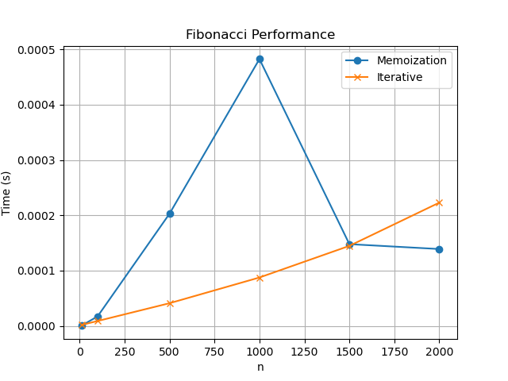

# Динамическое программирование

## Цель
Изучить метод динамического программирования (ДП) как мощный инструмент для
решения сложных задач путём их разбиения на перекрывающиеся подзадачи. Освоить два основных
подхода к реализации ДП: нисходящий (с мемоизацией) и восходящий (с заполнением таблицы).
Получить практические навыки выявления оптимальной подструктуры задач, построения таблиц ДП и
анализа временной и пространственной сложности алгоритмов.

---

## Задача
1. Реализовать классические алгоритмы динамического программирования.
2. Реализовать оба подхода (нисходящий и восходящий) для решения задач.
3. Провести сравнительный анализ эффективности двух подходов.
4. Проанализировать временную и пространственную сложность алгоритмов.
5. Решить практические задачи с применением ДП.

---

## Характеристики ПК
- **Процессор:** Intel x86_64  
- **Оперативная память:** 16 GB  
- **Операционная система:** Linux с ядром CachyOS
- **Версия Python:** Python 3.13

---

## 2. Реализация алгоритмов

### 2.1 Числа Фибоначчи
- Наивная рекурсия: O(2^n)  
- Рекурсия с мемоизацией: O(n)  
- Итеративная версия: O(n)  

**Пример работы:**
- n = 10  
- Memoization: 55  
- Iterative: 55  

---

### 2.2 0-1 Knapsack
- Таблица dp[i][w], i — номер предмета, w — вес  
- Восстановление выбранных предметов  
- Сложность: O(n*capacity)  

**Пример работы:**
- Weights = [10, 20, 30]  
- Values = [60, 100, 120]  
- Capacity = 50  
- Max value: 220  
- Items selected: [1, 2]  

---

### 2.3 Наибольшая общая подпоследовательность (LCS)
- Таблица dp[i][j], i,j — длины префиксов строк  
- dp[i][j] = dp[i-1][j-1]+1, если символы совпадают; иначе max(dp[i-1][j], dp[i][j-1])  
- Восстановление последовательности  
- Сложность: O(m*n)  

**Пример работы:**
- X = "AGGTAB"  
- Y = "GXTXAYB"  
- LCS length: 4  
- Sequence: "GTAB"  

---

### 2.4 Расстояние Левенштейна
- Таблица dp[i][j] для преобразования первых i символов первой строки в первые j символов второй  
- Сложность: O(m*n)  

**Пример работы:**
- s1 = "kitten"  
- s2 = "sitting"  
- Distance: 3  

---

### 2.5 Размен монет
- dp[i] = минимальное число монет для суммы i  
- Сложность: O(amount * len(coins))  

**Пример работы:**
- Coins = [1, 2, 5, 10, 20, 50, 100]  
- Amount = 87  
- Minimum coins: 5  

---

### 2.6 Наибольшая возрастающая подпоследовательность (LIS)
- dp[i] = длина LIS, заканчивающейся в arr[i]  
- Восстановление последовательности с помощью массива предшественников  
- Сложность: O(n^2)  

**Пример работы:**
- Array = [10, 22, 9, 33, 21, 50, 41, 60]  
- Length: 5  
- Sequence: [10, 22, 33, 50, 60]  

---

## 3. Исследование

### 3.1 Числа Фибоначчи
- Замер времени для разных n  
- Для больших n используется итеративный метод (избегаем RecursionError)  

---

### 3.2 Сравнение подходов
- Меморизация быстрее для маленьких n  
- Итеративный метод безопасен для больших n  

---

## 4. Контрольные вопросы

### 1. Какие два основных свойства задачи указывают на применение ДП?
1. Оптимальная подструктура — оптимальное решение задачи строится из оптимальных решений подзадач.  
2. Перекрывающиеся подзадачи — одни и те же подзадачи решаются многократно.

### 2. Разница между нисходящим (top-down) и восходящим (bottom-up) подходами
- Top-down: рекурсивное решение с мемоизацией, строится по мере необходимости.  
- Bottom-up: итеративное заполнение таблицы, решаем все подзадачи последовательно.

### 3. Как задача о рюкзаке 0-1 демонстрирует свойство оптимальной подструктуры?
Оптимальное решение для i предметов и веса w строится из оптимального решения для i-1 предмета и меньшего веса.  

### 4. Как строится и заполняется таблица для LCS?
- Таблица dp[i][j] размера (len(X)+1)x(len(Y)+1)  
- Если символы совпадают: dp[i][j] = dp[i-1][j-1]+1  
- Иначе: dp[i][j] = max(dp[i-1][j], dp[i][j-1])  
- Восстановление последовательности идёт от конца таблицы к началу

### 5. Как уменьшить сложность вычисления чисел Фибоначчи?
- Использовать мемоизацию (top-down) или итеративный метод (bottom-up)  
- Сложность снижается с O(2^n) до O(n) по времени и O(n) по памяти (или O(1) с оптимизацией хранения последних двух чисел)
